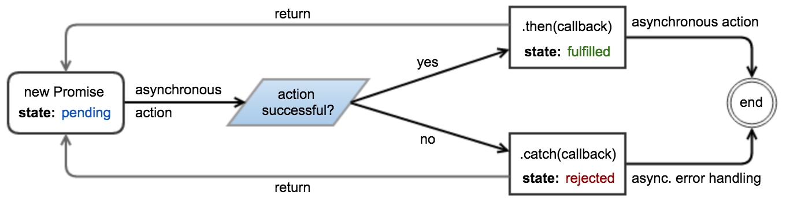

# JS Learnings

* [Closures](#closures)
* [Promises](#promises)
* [Prototype](#prototype)
* [Delete](#delete)


## Closures<br>
Before we should understand the concept of closure, there are two other features of javascript that must be understood - _first-class-functions_ and _inner-functions_

<u>First-Class-Function</u>: It can be constructed at runtime and assigned to variables. 
    They can also be passed to, and returned by other functions.

    

    
        var foo = function(){
            console.log('Hello');
        }

        var bar = function(args){
            return args;
        }

        bar(foo)();


<u>Inner-Function</u>: It referred to as nested functions, are functions that are defined inside of another function.


        var add = function(v1, v2){
            function doAdd(){
                return v1 + v2;
            }
            return doAdd();
        }

        var foo = add(10, 10);     


    Note: One important characteristic of inner functions is that they have implicit access to the outer function’s scope.
    


<u>Closures</u> - A closure is created when an inner function is made accessible from outside of the function that created it. This typically occurs when an outer function returns an inner function. When this happens, the inner function maintains a reference to the environment in which it was created. 

        function add(value1) {
            return function doAdd(value2) {
                return value1 + value2;
            };
        }

        var increment = add(1);
        var foo = increment(2);

    
    
Note: “value1” is a local variable of add(), and a non-local variable of doAdd(). Non-local variables refer to variables that are neither in the local nor the global scope.  “value2” is a local variable of doAdd().


<br><br>
## Promises

Promises provide a simpler alternative for executing, composing, and managing asynchronous operations when compared to traditional callback-based approaches. They also allow you to handle asynchronous errors using approaches that are similar to synchronous <span style="color:blue">_try/catch_</span>.

<u>States of Promises</u><br> 
**Pending** - The underlying operation has not yet completed, and the promise is pending fulfillment. <br>
**Fulfilled** - The operation has finished, and the promise is fulfilled with a value. This is analogous(clear/forsure) to returning a value from a synchronous function.<br>
**Rejected** -  An error has occurred during the operation, and the promise is rejected with a reason. This is analogous to throwing an error in a synchronous function.


A promise is said to be settled (or resolved) when it is either fulfilled or rejected. Once a promise is settled, it becomes immutable, and its state cannot change. The ``` then ``` and ``` catch ``` methods of a promise can be used to attach callbacks that execute when it is settled. These callbacks are invoked with the fulfillment value and rejection reason, respectively.<br><br>





Example:-<br>


        const promise =  new Promise((resolve, reject) => {
            // Perform some work (possibly asynchronous)
            // ...

            if(/* Work has successfully finished and produced "value" */){
                resolve(value);
            } else{
                // Something went wrong because of "reason"
                // The reason is traditionally an Error object, although
                // this is not required or enforced.
                let reason = new Error(message);
                reject(reason);

                // Throwing an error also rejects the promise.
                throw reason;
            }
        });


The then and catch methods can be used to attach fulfillment and rejection callbacks:

        promise.then(value =>{
            // Work has completed successfully,
            // promise has been fulfilled with "value"
        }).catch(reason => {
            // Something went wrong,
            // promise has been rejected with "reason"
        });


<br><br>
## Prototype

Every object is linked to a prototype object from which it can inherit properties. All objects created from object literals are linked to Object.prototype, an object that comes standard with JavaScript.

The prototype link is used only in retrieval. If we try to retrieve a property value from an object, and if the object lacks the property name, then JavaScript attempts to retrieve the property value from the prototype object. And if that object is lacking the property, then it goes to its prototype, and so on until the process finally bottoms out with Object.prototype. If the desired property exists nowhere in the prototype chain, then the result is the undefined value. This is called delegation.

The prototype relationship is a dynamic relationship. If we add a new property to a prototype, that property will immediately be visible in all of the objects that are based on that prototype


        var Person = function(name){
            this.name = name;
        }

        Person.prototype.getName = function() {
            return this.name;
        };

        var john = new Person("John");

        alert(john.getName());

        Person.prototype.sayMyName = function() {
            alert('Hello, my name is ' + this.getName());
        };

        john.sayMyName();


Until now I've been extending the base object, now I create another object and then inheriting from Person.

        var Customer = function(name) {
            this.name = name;
        };
        
        Customer.prototype = new Person();

        var myCustomer = new Customer('Dream Inc.');
        myCustomer.sayMyName();

        Customer.prototype.setAmountDue = function (amountDue) {
            this.amountDue = amountDue;
        };
        Customer.prototype.getAmountDue = function() {
            return this.amountDue;
        };

        myCustomer.setAmountDue(2000);
        alert(myCustomer.getAmountDue());


<br><br>
## Delete

The delete operator can be used to remove a property from an object. It will remove a property from the object if it has one. It will not touch any of the objects in the proto- type linkage.

        var output = (function(x){
            delete x;
            return x;
        })(0);
        
        console.log(output);  // Output is 0


        var x = 1;
        var output = (function(){
            delete x;
            return x;
        })();
        
        console.log(output);  // Output is 1


        var x = { foo : 1};
        var output = (function(){
            delete x.foo;
            return x.foo;
        })();
        
        console.log(output);  // Output is "_undefined_"


        var Employee = {
            company: 'xyz'
        }
        var emp1 = Object.create(Employee);
        delete emp1.company
        console.log(emp1.company);

Q:- What is `undefined x 1` in javascript?

        var trees = ["redwood","bay","cedar","oak","maple"];
        delete trees[3]; 
        
        //["redwood", "bay", "cedar", undefined × 1, "maple"]

        trees[3] === undefined  //true
        

